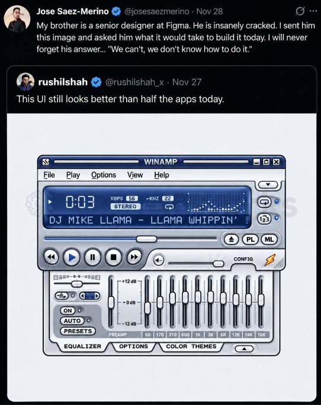
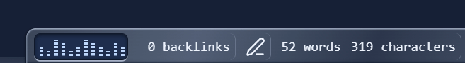
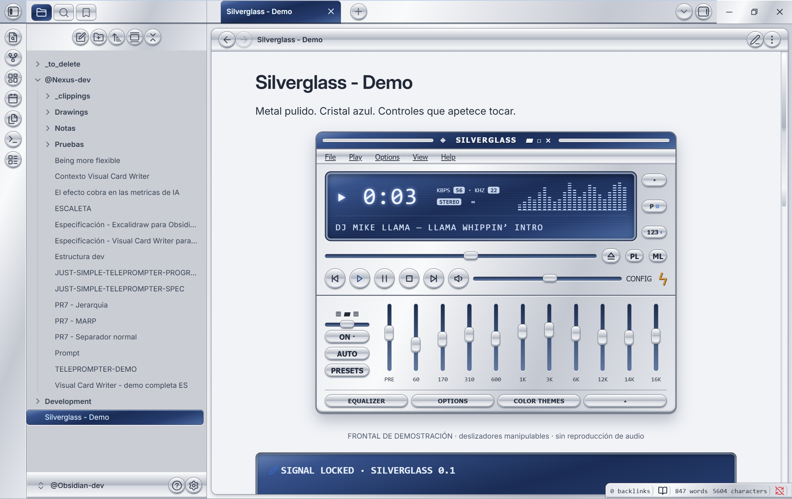
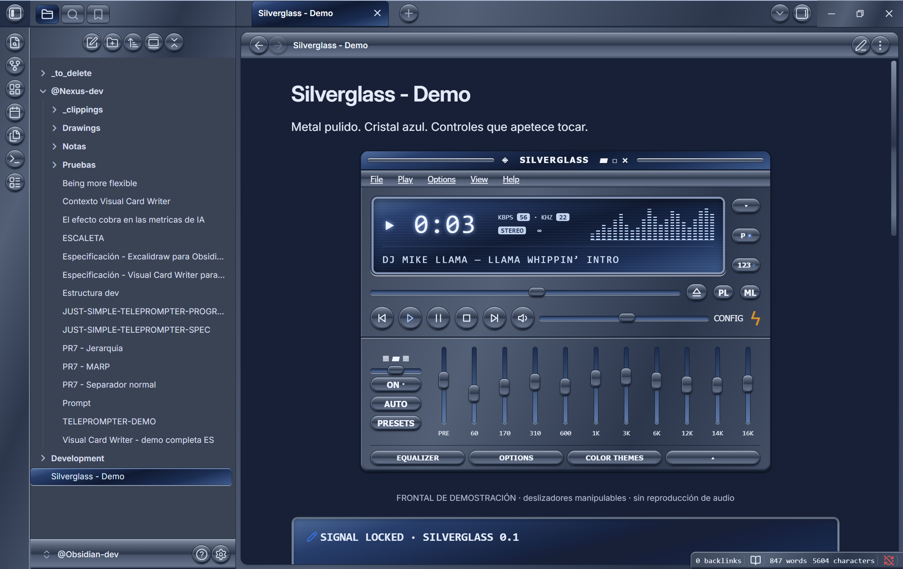
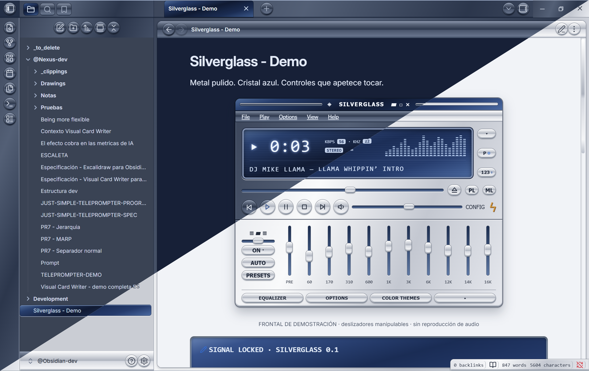

# Silverglass

A silver-and-blue skeuomorphic theme for [Obsidian](https://obsidian.md): polished metal, recessed blue glass, bevelled buttons, and controls that look like something you can touch. Light silver and dark gunmetal modes. I'm David Hurtado, and I built this with **Máquina** -the name I use for my usual AI assistant: sometimes ChatGPT, sometimes Claude, and sometimes Copilot.

## From a Winamp post to a working theme in 13 minutes

I saw a post on X by Jose Saez-Merino, quoting Rushil Shah, with an image of a classic Winamp interface: silver metal, blue glass, round transport buttons, and an equalizer. It made me wonder: could Máquina build an Obsidian theme with those same design principles?



*The original post screenshot I shared with Máquina to start the project. Included as the visual reference for this story; the post and Winamp artwork belong to their respective owners and are not covered by this project's MIT license.*

I showed the screenshot to Máquina and asked whether similar themes existed and how much work it would take to build one. Its estimate went as far as **one to two weeks** for a polished, distributable theme. I laughed. I bet it could do a first version in **less than half an hour**, and told it to go ahead.

**Máquina built and installed the first working prototype in 13 minutes.**

I then tried it in Obsidian and sent back screenshots pointing out small issues: off-center icons, inconsistent button sizes, slider alignment, repeated dropdown arrows, the right-hand title bar, and tag contrast in light mode. Máquina corrected them, and those refinements became the 0.1.x releases.

That's how Silverglass came about. I brought the reference, challenged the estimate, and reviewed the results; Máquina wrote the code and made the corrections. The 13 minutes describe the first working prototype. We spent additional time refining and testing the version you can download here.

## Now with equalizer!



## Screenshots

These are the light and dark screenshots I selected for this release.

### Light



### Dark



### Light and dark comparison



## Install

Silverglass has been **accepted into the Obsidian Community Themes directory**. You can install it from its [official directory listing](https://community.obsidian.md/themes/silverglass).

### Manual installation

You can also install it directly from GitHub:

1. Download `theme.css` and `manifest.json` from the [latest release](https://github.com/DavidHurtadoAI/silverglass/releases/latest).
2. Create a folder named `Silverglass` inside your vault's `.obsidian/themes/` folder.
3. Place both downloaded files directly inside that folder.
4. In Obsidian, open **Settings → Appearance** and select **Silverglass**. Reload Obsidian if the theme does not appear immediately.
5. Choose **Light** for the silver finish or **Dark** for gunmetal.

To stop using it, select the default theme in Appearance. No plugin, account, network access or payment is required by the theme.

## Try the optional prototype

- **Inside Obsidian:** copy [`examples/Silverglass - Demo.md`](examples/Silverglass%20-%20Demo.md) into your vault, activate Silverglass, and open the note in Reading view. The example is in Spanish because that's the language I used with Máquina.
- **In a browser:** download or clone this repository and open [`preview.html`](preview.html) locally. Keep `theme.css` beside it. This is a standalone prototype, not a hosted website.

The example uses inline HTML and SVG. It contains no scripts or external resources. The full-size front panel is designed for a reasonably wide note pane; narrow panes may clip parts of this optional demo.

## Decorative status-bar equalizer

A small blue-glass spectrum animates in the desktop status bar. It is entirely CSS: no plugin, JavaScript, audio access or network connection. The bars follow a decorative loop, not the music playing on your computer.

All bars grow upward from a shared bottom baseline. The default loop lasts 0.8 seconds, with about ten visible bar updates per second.

The equalizer is **enabled by default**, including without plugins. If you use the optional [Style Settings plugin](https://github.com/mgmeyers/obsidian-style-settings), open **Settings > Style Settings > Silverglass** to switch **Decorative equalizer** on or off. **Equalizer cycle duration** adjusts the speed: smaller values are faster. Style Settings is only needed for these controls, not the effect itself.

Resource use is expected to be low: CSS repaints a tiny 76 by 22 pixel element without changing the surrounding layout. It is not zero-cost, and CPU/GPU use has not been benchmarked. Turning it off in Style Settings removes the animation entirely.

The animation pauses when Obsidian loses focus or you hover over the status bar. It becomes static when your system requests reduced motion and hides in windows 700 pixels wide or narrower to leave room for status information.

To hide it, enable a CSS snippet containing:

```css
body {
  --sg-equalizer-display: none;
}
```

To keep the display but freeze the animation, use `--sg-equalizer-play-state: paused;` instead.

## Blue-glass callouts

Use this in any note:

```markdown
> [!lcd] SIGNAL LOCKED
> Your text inside a recessed blue-glass display.
```

## Compatibility and validation

- Version **0.1.7**, tested on **Obsidian 1.14.2 for Windows**.
- `minAppVersion` is conservatively set to `1.14.2`; older versions have not been verified.
- Both light and dark modes were checked in the app. Mobile devices and other operating systems have not been tested.
- The theme passes the official `stylelint-config-obsidianmd` configuration with zero errors and warnings. This does not guarantee compatibility with every plugin.
- Original CSS, standard Obsidian variables, local embedded SVG chevrons, no remote fonts or images, no telemetry, and no `!important` declarations.

Please report issues with your Obsidian version, operating system, light/dark mode, and a screenshot.

## Development

```sh
npm ci --ignore-scripts
npm run lint
```

Edit `theme.css`. To test, copy it and `manifest.json` into the theme folder of a development vault. The repository contains no automatic installer and does not modify a vault when you run the linter.

## License and credits

[MIT](LICENSE) © 2026 David Hurtado for the theme code and original demo. I supplied the theme screenshots for this project.

Visual inspiration: the classic Winamp interface in the post I shared. The original post screenshot is included above for context; no Winamp skin bitmap, logo, proprietary font or source code is used as an asset in the theme. Silverglass is not affiliated with Winamp or Obsidian. The demo track label is a nod to the reference image.
